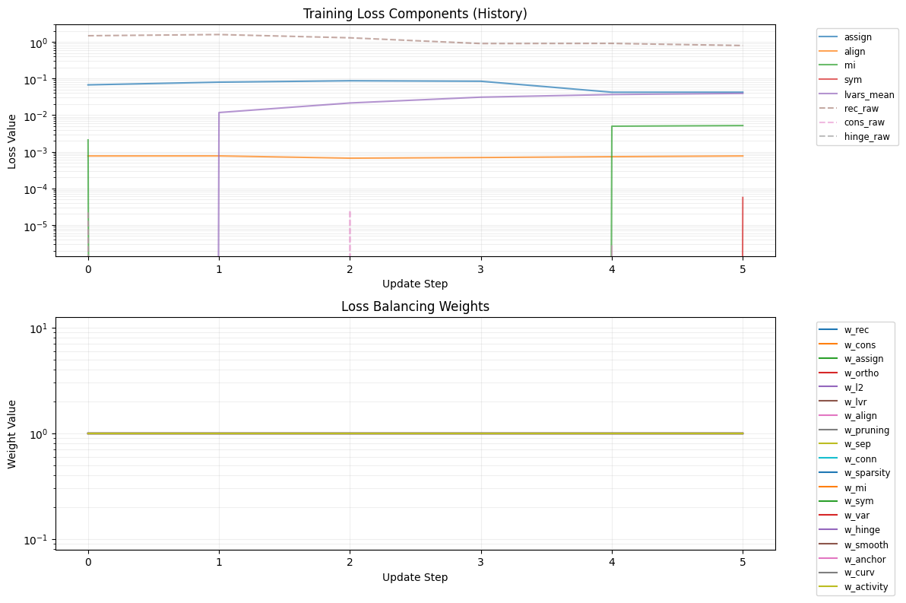
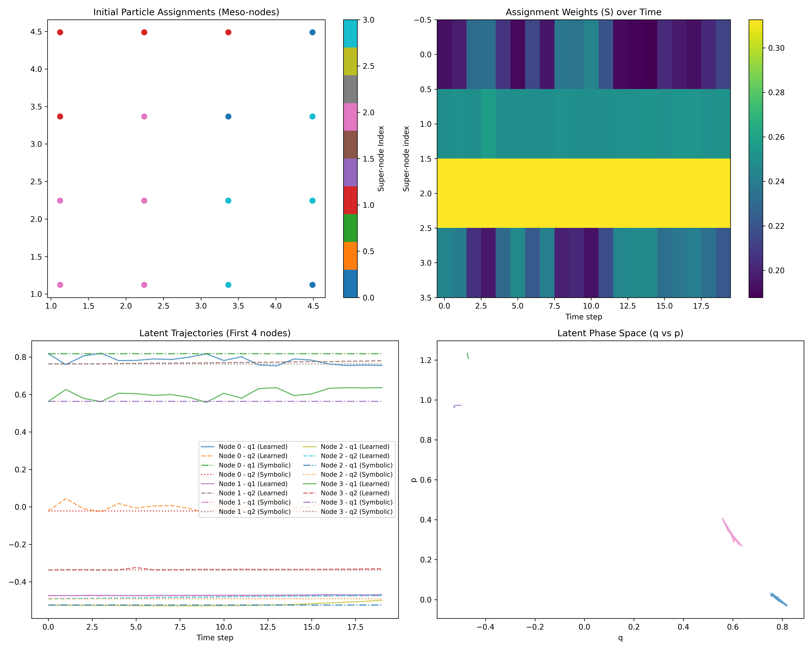

# Neural-Symbolic Discovery Pipeline

This project implements a sophisticated **Neural-Symbolic Discovery Pipeline** for automated coarse-graining of particle dynamics. It bridges the gap between micro-scale particle dynamics and meso-scale symbolic equations using a stack of Graph Neural Networks (GNNs), Symplectic ODEs, and Genetic Programming.

## Overview

The pipeline consists of three main stages:

1. **Neural Encoder**: GNN-based encoder with hierarchical soft-assignment pooling to compress particle dynamics into super-node representations
2. **Latent Dynamics**: Hamiltonian-constrained ODE dynamics that preserve physical inductive biases
3. **Symbolic Distillation**: Genetic programming to extract interpretable symbolic equations from learned neural dynamics

## Key Features

### 1. Hamiltonian Inductive Bias
- Enforces canonical equations: $\dot{q} = \partial H/\partial p$ and $\dot{p} = -\partial H/\partial q$
- Maintains Liouville's Theorem (phase-space volume preservation)
- Includes learnable dissipation terms for realistic systems

### 2. Stable Hierarchical Pooling
- Prevents "latent flickering" through temporal consistency
- Ensures spatial contiguity of super-nodes
- Dynamic resolution selection to find optimal meso-scale

### 3. Enhanced Symbolic Regression
- Physics-informed feature engineering
- Secondary optimization for constant refinement
- Coordinate alignment between neural and physical spaces
- Hamiltonian structure preservation

## Architecture

```
Particle Dynamics → GNN Encoder → Super-Node Latents → Hamiltonian ODE → Symbolic Equations
                    ↓              ↓                   ↓                ↓
                Pooling         Assignment       Symplectic        Genetic
                Loss            Consistency      Constraints       Programming
```

## Results Visualization


*Training history showing loss components and balancing weights over time.*


*Visualization of the discovery results including particle assignments, latent trajectories, and phase space analysis.*

## Installation

```bash
pip install -r requirements.txt
```

## Usage

### Recommended: Comprehensive Enhanced Execution

For the most comprehensive execution with all improvements, use the comprehensive enhanced version:

```bash
python comprehensive_improved_train.py --epochs 500 --steps 500 --particles 16 --super_nodes 4
```

The comprehensive enhanced version includes:
- Learnable basis functions to address the basis function bottleneck
- Optimized ODE functions to reduce adjoint sensitivity complexity
- Improved hyperparameter management with auto-tuning
- Enhanced symbolic distillation with secondary optimization
- Robust symbolic proxy with validation
- Multi-scale loss balancing
- Configurable problem type optimization
- Enhanced energy conservation mechanisms
- Comprehensive early stopping criteria

### Unified Training Pipeline

For a unified approach that combines all improvements with performance optimizations:

```bash
python unified_train.py --particles 16 --super_nodes 4 --epochs 500 --steps 500 --sim spring --hamiltonian --memory_efficient --quick_symbolic
```

Additional options for performance tuning:
- `--memory_efficient`: Use memory-saving optimizations for large datasets
- `--quick_symbolic`: Use faster symbolic distillation with reduced populations/generations
- `--batch_size N`: Control batch size for training steps (default: 10)

### Enhanced Execution

For the most advanced execution with all improvements, use the enhanced version:

```bash
python main_enhanced_complete.py --config config.yaml --problem_type physics
```

The enhanced version includes:
- Learnable basis functions to address the basis function bottleneck
- Optimized ODE functions to reduce adjoint sensitivity complexity
- Improved hyperparameter management with auto-tuning
- Enhanced symbolic distillation with secondary optimization
- Robust symbolic proxy with validation
- Multi-scale loss balancing
- Configurable problem type optimization

### Alternative: Enhanced Execution with Additional Features

For enhanced execution with additional features:

```bash
python main_enhanced.py --epochs 1000 --steps 800 --particles 16 --super_nodes 4 --use_learnable_bases --use_robust_proxy --use_enhanced_balancer
```

### Alternative: Fast Execution

For faster execution with performance optimizations, use the optimized version:

```bash
python fast_train.py --epochs 1000 --steps 200 --particles 8 --super_nodes 2
```

The optimized version includes:
- Gradient accumulation for memory efficiency
- Selective consistency loss computation
- Efficient ODE solving with looser tolerances during training
- Early stopping to prevent overfitting
- Edge caching for faster data preparation

### Performance-Optimized Execution

For maximum performance with reduced computational complexity, use the optimized version:

```bash
python unified_train.py --epochs 200 --steps 50 --particles 4 --super_nodes 2 --memory_efficient --quick_symbolic
```

The performance-optimized version includes:
- Reduced model complexity with fewer parameters
- Optimized ODE solver parameters for faster training
- Reduced symbolic regression complexity (smaller populations and generations)
- Streamlined feature computation to prevent combinatorial explosion
- Early stopping and adaptive learning rates for efficiency
- Memory-efficient operations throughout the pipeline
- Sampling strategies to reduce memory usage during visualization
- Batch processing controls for managing computational load
- Tensor dimension compatibility fixes to prevent runtime errors

### Improved Optimized Execution

For improved performance with additional optimizations:

```bash
python improved_optimized_fast_train.py --epochs 300 --steps 100 --particles 8 --super_nodes 3
```

### Original Version

The original version is still available for reference:

```bash
python main.py --epochs 1000 --steps 200 --particles 8 --super_nodes 2
```

Note: The original version is significantly slower and may timeout with larger parameters.

### Basic Example

```python
import torch
from model import DiscoveryEngineModel
from symbolic import SymbolicDistiller
from enhanced_symbolic import EnhancedSymbolicDistiller
from coordinate_mapping import AlignedHamiltonianSymbolicDistiller
from stable_pooling import StableHierarchicalPooling

# Initialize model
model = DiscoveryEngineModel(
    n_particles=100,
    n_super_nodes=10,
    node_features=4,
    latent_dim=4,
    hamiltonian=True
)

# Train the model on particle dynamics data
# ... training code ...

# Extract latent dynamics data
latent_states, latent_derivs = extract_latent_data(model, dataset, dt=0.01)

# Distill symbolic equations with enhanced features
distiller = EnhancedSymbolicDistiller(
    populations=2000,
    generations=40,
    secondary_optimization=True
)

equations = distiller.distill_with_secondary_optimization(
    latent_states=latent_states,
    targets=latent_derivs,
    n_super_nodes=10,
    latent_dim=4
)

# For Hamiltonian systems with coordinate alignment
hamiltonian_distiller = AlignedHamiltonianSymbolicDistiller(
    populations=2000,
    generations=40,
    enforce_hamiltonian_structure=True
)

# Fit coordinate mapper if physical coordinates are available
# hamiltonian_distiller.fit_coordinate_mapper(neural_latents, physical_coords)

# Distill with alignment
equations = hamiltonian_distiller.distill_with_alignment(
    neural_latents=latent_states,
    targets=latent_derivs,
    n_super_nodes=10,
    latent_dim=4
)
```

### Advanced Configuration

```python
# Configure model with enhanced pooling
from stable_pooling import StableHierarchicalPooling, DynamicLossBalancer

model = DiscoveryEngineModel(
    n_particles=100,
    n_super_nodes=15,  # Adjust based on your system
    node_features=4,
    latent_dim=6,      # Must be even for Hamiltonian systems
    hamiltonian=True,
    dissipative=True   # Include energy dissipation
)

# Configure enhanced symbolic distillation
distiller = EnhancedSymbolicDistiller(
    populations=3000,           # Larger population for complex systems
    generations=50,             # More generations for better exploration
    secondary_optimization=True, # Refine constants with scipy optimization
    opt_method='L-BFGS-B',      # Optimization algorithm
    opt_iterations=200          # Max iterations for optimization
)

# Use coordinate alignment for better interpretability
coord_distiller = AlignedHamiltonianSymbolicDistiller(
    populations=2500,
    generations=45,
    enforce_hamiltonian_structure=True
)
```

## Key Improvements Over Baseline

### 1. Enhanced Symbolic Regression
- **Secondary Optimization**: Uses scipy.optimize to refine constants in discovered expressions
- **Constant Refinement**: Improves accuracy of physics-specific parameters
- **Pareto Optimization**: Balances accuracy and complexity

### 2. Coordinate Alignment
- **Neural-Physical Mapping**: Aligns neural latent space with interpretable physical coordinates
- **Rotation Invariance**: Handles rotated coordinate systems learned by the encoder
- **Hamiltonian Structure Preservation**: Maintains proper q/p coordinate relationships

### 3. Collapse Prevention
- **Dynamic Loss Balancing**: Adjusts loss weights during training to prevent mode collapse
- **Minimum Active Nodes**: Ensures sufficient super-nodes remain active
- **Balance Loss**: Encourages uniform usage of super-nodes

### 4. Learnable Basis Functions
- **Adaptive Feature Generation**: Learns novel functional forms beyond predefined primitives
- **Attention Mechanisms**: Dynamically selects relevant basis functions based on input
- **Residual Connections**: Maintains information flow through the basis expansion

### 5. Optimized ODE Computation
- **Reduced Adjoint Complexity**: Efficient gradient computation for Hamiltonian systems
- **Memory-Efficient Solvers**: Trade accuracy for reduced memory usage when needed
- **Adaptive Integration**: Chooses appropriate solver based on system properties

### 6. Hyperparameter Auto-Tuning
- **Configurable Problem Types**: Optimizes for small, large, physics, or chaotic systems
- **Automatic Parameter Search**: Finds optimal hyperparameters for specific problems
- **Validation-Based Selection**: Uses held-out data to select best configurations

### 7. Robust Symbolic Proxy
- **Equation Validation**: Validates symbolic expressions for numerical stability before integration
- **Complexity Control**: Limits expression complexity to prevent numerical instabilities
- **Gradient-Based Selection**: Uses gradient information to select stable symbolic expressions

### 8. Enhanced Loss Balancing
- **Gradient-Based Weighting**: Uses gradient information to dynamically adjust loss weights
- **Priority Loss Maintenance**: Ensures critical losses (e.g., collapse prevention) maintain minimum influence
- **Adaptive Adaptation**: Adjusts adaptation rates based on training progress

### 9. Transformer-Based Symbolic Discovery
- **Basis-Free Discovery**: Moves toward discovering symbolic expressions without relying on hand-crafted basis functions
- **Sequence-to-Sequence Modeling**: Uses transformer architectures to generate symbolic expressions
- **Learnable Representations**: Learns distributed representations of mathematical operations

### 10. Improved Energy Conservation
- **Robust Energy Calculation**: Implements soft-floors for particle distances to prevent singularities
- **Energy Tracking**: Monitors energy conservation during training and inference
- **Conservation Loss**: Adds explicit energy conservation terms to the loss function

## Mathematical Foundation

### Hamiltonian Mechanics
For a system with generalized coordinates $q$ and momenta $p$, the Hamiltonian $H(q,p)$ defines the dynamics:
$$\dot{q} = \frac{\partial H}{\partial p}, \quad \dot{p} = -\frac{\partial H}{\partial q}$$

Our model learns $H$ as a neural network and computes gradients analytically.

### Pooling Objective
The hierarchical pooling minimizes:
$$\mathcal{L}_{pool} = \mathcal{L}_{entropy} + \mathcal{L}_{diversity} + \mathcal{L}_{spatial} + \mathcal{L}_{consistency} + \mathcal{L}_{collapse}$$

Where:
- $\mathcal{L}_{entropy}$: Encourages hard assignments
- $\mathcal{L}_{diversity}$: Prevents all nodes from assigning to one super-node
- $\mathcal{L}_{spatial}$: Maintains spatial coherence
- $\mathcal{L}_{consistency}$: Ensures temporal stability
- $\mathcal{L}_{collapse}$: Prevents resolution collapse

## Testing

Run the test suite:

```bash
python -m pytest test_*.py -v
```

Or run individual tests:

```bash
python test_symbolic.py
python test_ode.py
python test_pareto.py
python test_implemented_fixes.py
python test_enhancements.py
python test_robustness.py
python test_verifications.py
```

## Files Overview

- `model.py`: Core neural network architecture
- `optimized_model.py`: Performance-optimized neural network architecture with reduced computational complexity
- `symbolic.py`: Basic symbolic regression implementation
- `enhanced_symbolic.py`: Enhanced symbolic regression with secondary optimization
- `improved_symbolic.py`: Further improvements to symbolic regression
- `improved_symbolic_distillation.py`: Performance-optimized symbolic regression with enhanced feature selection
- `optimized_symbolic_distillation.py`: Performance-optimized symbolic regression with streamlined feature computation
- `robust_symbolic.py`: Robust symbolic proxy with validation and stability mechanisms
- `coordinate_mapping.py`: Neural-physical coordinate alignment
- `stable_pooling.py`: Enhanced pooling with collapse prevention
- `hamiltonian_symbolic.py`: Hamiltonian structure preservation
- `balanced_features.py`: Physics-informed feature engineering
- `optimized_symbolic.py`: Optimized symbolic dynamics with caching
- `simulator.py`: Particle dynamics simulators
- `engine.py`: Main discovery engine
- `learnable_basis.py`: Learnable basis functions to address basis function bottleneck
- `optimized_ode.py`: Optimized ODE functions to reduce adjoint sensitivity complexity
- `config_manager.py`: Configuration management and hyperparameter auto-tuning
- `main_enhanced_complete.py`: Complete enhanced pipeline with all improvements
- `main_enhanced.py`: Enhanced pipeline with additional features
- `fast_train.py`: Fast training script with performance optimizations
- `improved_optimized_fast_train.py`: Improved optimized training script with additional optimizations
- `optimized_fast_train.py`: Maximum performance training script with reduced computational complexity
- `comprehensive_improved_train.py`: Comprehensive improved training with enhanced energy conservation
- `unified_train.py`: Unified training pipeline combining all improvements with performance optimizations
- `example_usage.py`: Example usage of the pipeline
- `config.yaml`: Configuration file for the enhanced pipeline
- `enhanced_balancer.py`: Enhanced dynamic loss balancer with gradient-based weighting
- `transformer_symbolic.py`: Transformer-based symbolic expression generator for basis-free discovery
- `train_utils.py`: Training utilities including improved early stopping and robust energy calculation
- `visualization.py`: Visualization tools for training history and discovery results
- `main.py`: Original baseline implementation
- `refactored_engine.py`: Refactored engine implementation with improved modularity
- `refactored_stable_pooling.py`: Refactored stable pooling implementation with enhanced maintainability
- `pure_symbolic_functions.py`: Pure symbolic functions for symbolic regression
- `common_losses.py`: Common loss functions used across the pipeline
- `diagnostic_unified_train.py`: Diagnostic version of unified training with detailed logging and debugging capabilities
- `optimized_unified_train.py`: Optimized unified training with additional performance enhancements
- `test_changes.py`: Tests for recent changes
- `test_enhancements.py`: Tests for all enhancements
- `test_implemented_fixes.py`: Tests for implemented fixes
- `test_mps_fix.py`: Tests for MPS (Apple Silicon) compatibility fixes
- `test_ode.py`: Tests for ODE functionality
- `test_pareto.py`: Tests for Pareto optimization
- `test_robustness.py`: Tests for robustness improvements
- `test_symbolic.py`: Tests for symbolic regression
- `test_verifications.py`: Verification tests
- `test_optimized_pipeline.py`: Tests for optimized pipeline components
- `training_history.png`: Visualization of training progress and loss components
- `discovery_result.png`: Visualization of discovery results including particle assignments and latent dynamics

## Contributing

1. Fork the repository
2. Create a feature branch (`git checkout -b feature/amazing-feature`)
3. Commit your changes (`git commit -m 'Add amazing feature'`)
4. Push to the branch (`git push origin feature/amazing-feature`)
5. Open a Pull Request

## License

This project is licensed under the MIT License - see the LICENSE file for details.

## Citation

If you use this code in your research, please cite:

```
@article{neural-symbolic-discovery,
  title={Neural-Symbolic Discovery of Physical Laws from Particle Dynamics},
  author={Emergentia Team},
  year={2026}
}
```

## Acknowledgments

- Inspired by recent advances in neural-symbolic integration
- Built on top of PyTorch Geometric and gplearn
- Thanks to the physics and ML communities for continued inspiration